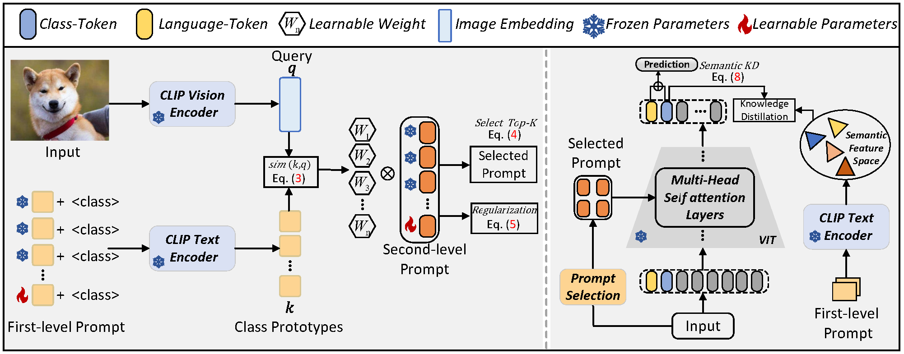
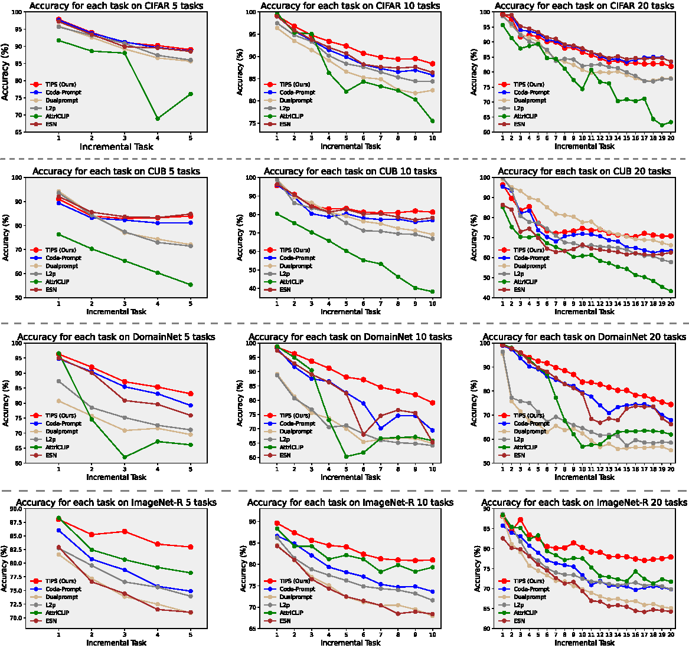

### Two-Level Prompt for Rehearsal-free Continual Learning

**This repository holds the source code for TIPS: Two-Level Prompt for Rehearsal-free Continual Learning**

Our TIPS method features a two-level prompt selection strategy and semantic knowledge distillation to adapt a pre-trained Vision Transformer for continual learning tasks.

### The overall structure of our model:
<p align="center">

</p>


Results of TIPS and recent SOTA across CIFAR, ImageNet-R, CUB-200, and DomainNet in 3 incremental scenarios (5, 10, and 20 tasks).
<p align="center">

</p>


### 🗂️ Dependencies

1. [torch 2.0.1](https://github.com/pytorch/pytorch)
2. [torchvision 0.15.2](https://github.com/pytorch/vision)
3. [timm 0.6.12](https://github.com/huggingface/pytorch-image-models)
4. [tqdm](https://github.com/tqdm/tqdm)
5. [numpy](https://github.com/numpy/numpy)
6. [scipy](https://github.com/scipy/scipy)
7. [easydict](https://github.com/makinacorpus/easydict)


### 🔑 Run experiment

1. Edit the `TIPS.json` file for global settings and hyperparameters.
2. Run:

    ```bash
    python main.py --config=./exps/TIPS.json
    ```
